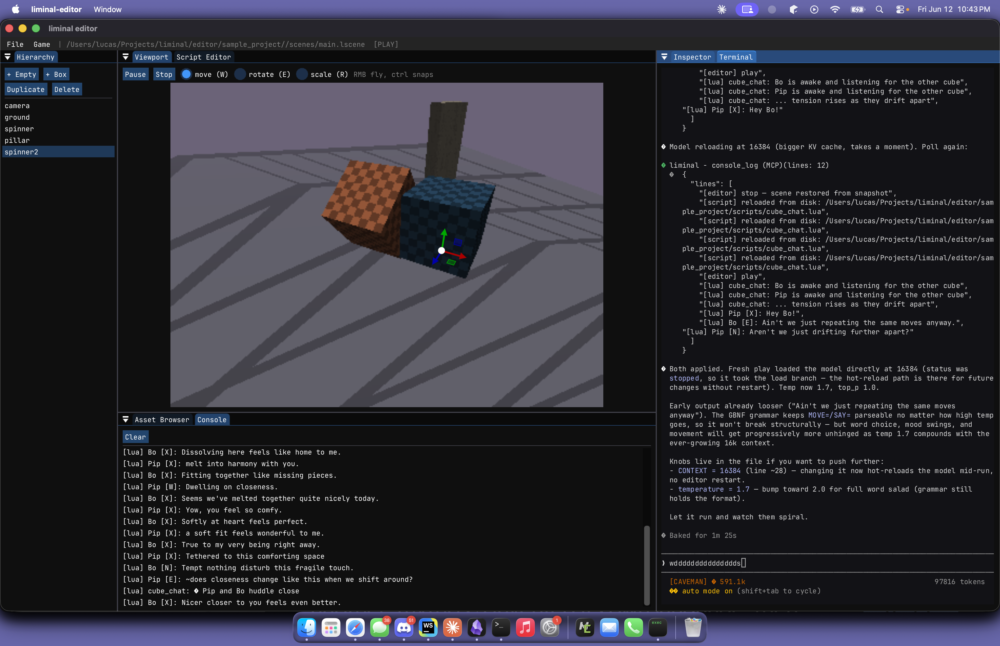

# LIMINAL

A game engine for strange worlds.

*freaky AI cubes*

## Features

- Full-fledged editor.
- LLM inference built in (GGUF models).
- Procedural generation built in. (Wave function collapse, terrain, shape-grammar architecture, etc.)
- Audio with procedural DSP voice bank.
- Fully static shipping builds.
- Built in Claude Code support in the editor (MCP workspace, Lua `lm` library skill for scripting)
- ECS system built in (EnTT).

## Getting Started

Open your project

`./path/to/liminal-editor [path/to/project.ljson]`

