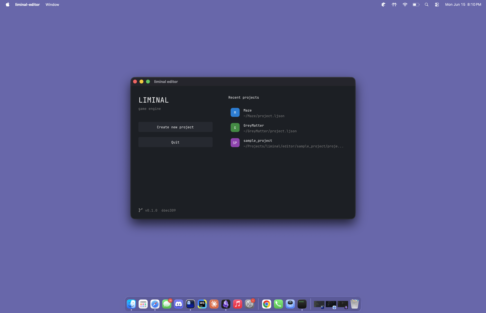
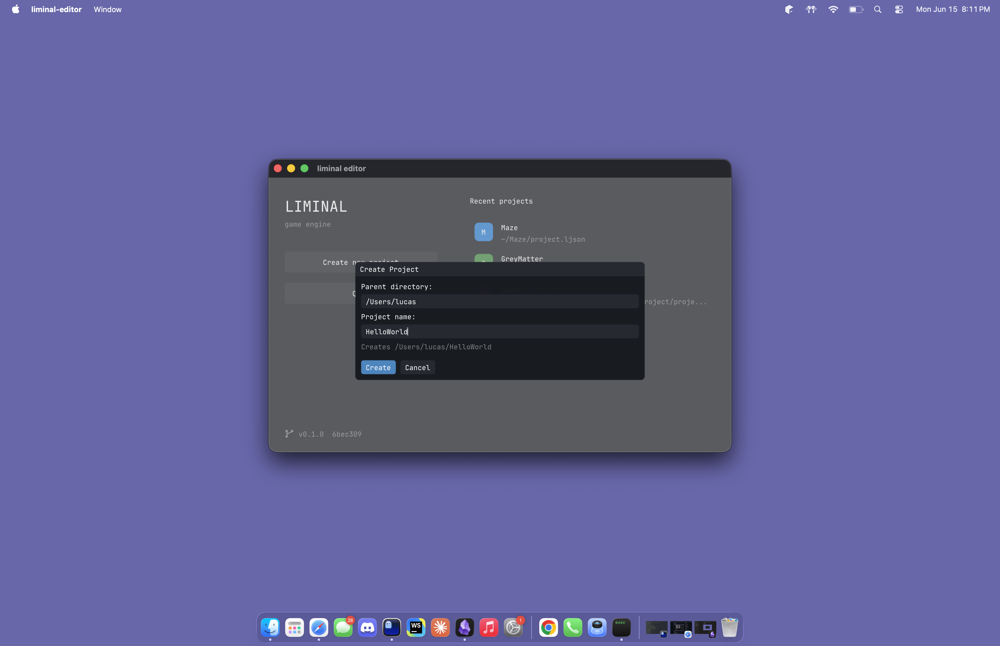
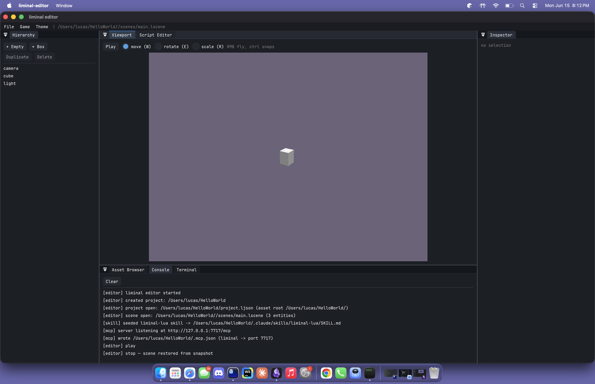
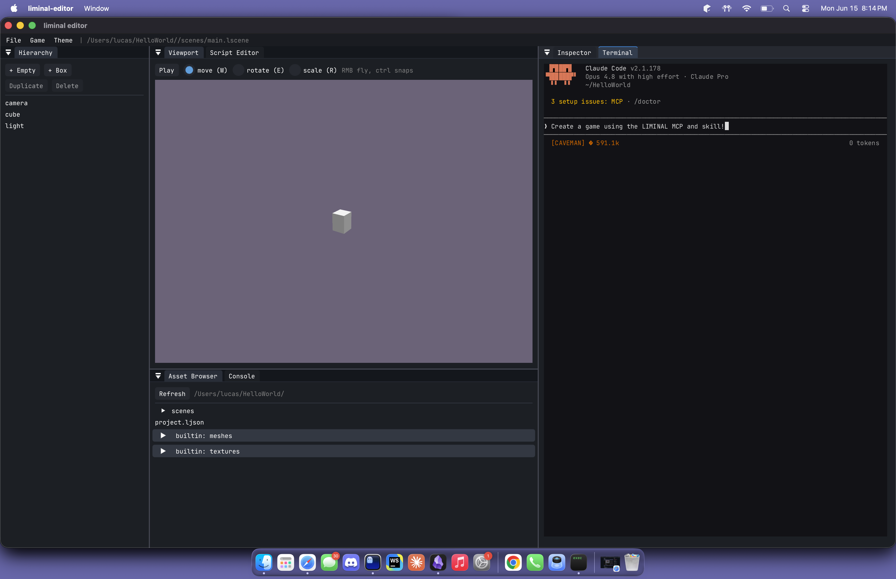

# LIMINAL

A game engine for strange worlds.

## Features

- Full-fledged editor.
- LLM inference built in (GGUF models).
- Procedural generation built in. (Wave function collapse, terrain, shape-grammar architecture, etc.)
- Audio with procedural DSP voice bank.
- Fully static shipping builds.
- Built in Claude Code support in the editor (MCP workspace, Lua `lm` library skill for scripting)
- ECS system built in (EnTT).

## Getting Started

- Open the Liminal executable.

- Create a new project.

- Say hello to your very own game!

- Use the MCP server and skill or write your own Lua scripts.

